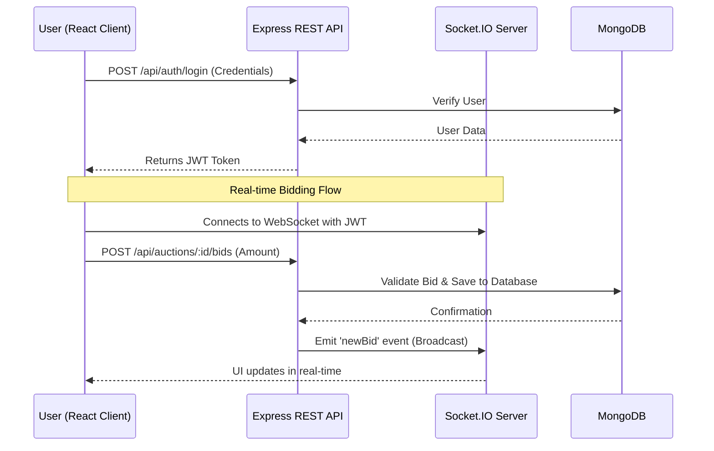

# Bike Auction Platform

A production-grade, full-stack real-time auction platform for exclusive motorcycles. Built as a comprehensive demonstration of strong engineering fundamentals, clean architecture, and modern web development practices.

## 🚀 Features

### User Experience
- **Real-Time Bidding**: Powered by Socket.IO, bids update instantly across all connected clients without refreshing.
- **Modern Interface**: Premium UI built with Tailwind CSS, featuring glassmorphism, responsive design, and fluid micro-animations.
- **Dynamic Dashboards**: Dedicated views for bidders to track their active bids and past won auctions.

### Admin Capabilities
- **Lifecycle Management**: Admins can seamlessly create bikes, schedule auctions, and force start/end them.
- **Automated State Transitions**: Auctions automatically start and close based on scheduled times. Winners are declared and saved securely upon closing.

### Security & Production Readiness
- **JWT Authentication**: Secure stateless session management with `HttpOnly` tokens via interceptors.
- **Password Hashing**: Stored credentials are mathematically secured using bcrypt.
- **Global Observability**: Centralized HTTP request and error logging utilizing `Winston` and `Morgan`.
- **Automated Testing**: Comprehensive backend test suites powered by `Jest` and `Supertest`.

---

## 🏗️ Architecture & System Design

### High-Level Architecture Flowchart

The system utilizes a modern, decoupled architecture. Below is a flowchart demonstrating how the client, server, database, and real-time components interact during a live auction:



### Component Design & Philosophy

1. **Client Layer (Frontend)**
   - **Framework**: Built with React (Vite) for blazing-fast hot module replacement and an optimized production build.
   - **Styling**: Tailwind CSS is heavily utilized to build a responsive, modern "glassmorphism" UI that feels premium and trustworthy.
   - **State Management**: The Context API manages global states like User Authentication (`AuthContext`) and Real-time connections (`SocketContext`).

2. **Server Layer (Backend)**
   - **API Framework**: Node.js and Express.js provide a robust, asynchronous environment for handling RESTful requests.
   - **Controllers & Routes**: Business logic is separated into specific controllers (`authController`, `auctionController`, `bidController`) to maintain a clean codebase.
   - **Middleware Pipeline**: Requests pass through security checks (`Helmet`, `Cors`), parsing, and global error handling.

3. **Real-Time Layer (WebSockets)**
   - **Socket.IO**: Deeply integrated with the Express server.
   - **Architecture Strategy**: To prevent race conditions and ensure data integrity during high-frequency bidding, all **upstream mutations** (placing a bid) are handled via standard HTTP POST routes. This ensures bids pass through our standard authentication, validation, and error-handling pipelines before being saved. Once successfully saved to MongoDB, the server uses Socket.IO solely for **downstream broadcasting** to update all connected clients instantly.

4. **Database Design (MongoDB)**
   - **User**: Stores authentication and role data (Admin vs User).
   - **Bike**: Represents the physical asset, separating the asset's details (make, model, images) from the auction event.
   - **Auction**: Links to a `Bike` and contains scheduling information (start time, end time).
   - **Bid (Embedded)**: Bids are stored as a sub-document array within the `Auction` schema. This is highly optimized for fast reads, allowing us to fetch an auction and its entire bid history in a single, lightning-fast query without expensive JOIN operations.

---

## 🚦 Setup Instructions

### Prerequisites
- Node.js (v18 or higher)
- MongoDB (Local or Atlas URI)

### 1. Clone & Install
```bash
# Install backend dependencies
cd server
npm install

# Install frontend dependencies
cd ../client
npm install
```

### 2. Environment Variables
Create a `.env` file in the `server` directory:
```env
PORT=5000
MONGO_URI=mongodb://localhost:27017/bikeauction
JWT_SECRET=your_super_secret_jwt_key
NODE_ENV=development
```

Create a `.env` file in the `client` directory:
```env
VITE_API_URL=http://localhost:5000/api
VITE_SOCKET_URL=http://localhost:5000
```

### 3. Database Seeding (Optional)
To populate the database with dummy bikes and an admin account:
```bash
cd server
npm run seed
```
*Admin Login: `admin@bikeauction.com` / `admin123`*

### 4. Run the Application
Start both the server and client in development mode:

**Server** (Terminal 1)
```bash
cd server
npm run dev
```

**Client** (Terminal 2)
```bash
cd client
npm run dev
```

---

## 🧪 Automated Testing

The backend is fully instrumented with automated tests using `Jest`, `Supertest`, and an in-memory MongoDB server for isolated, rapid test execution.

```bash
cd server
npm test
```

---

## 📈 Scalability & Deployment Considerations

### Horizontal Scaling
The current architecture uses a localized Socket.IO instance. To scale horizontally across multiple Node.js processes (e.g., in a Kubernetes cluster or AWS ECS):
1. **Redis Adapter**: Introduce `@socket.io/redis-adapter` so that instances can share pub/sub events.
2. **Sticky Sessions**: Configure the load balancer (e.g., NGINX or AWS ALB) to use sticky sessions if long-polling fallback is required.

### Deployment 
- **Frontend**: The Vite React app can be built (`npm run build`) and served via a CDN (Vercel, Netlify, or AWS CloudFront).
- **Backend**: The Express server is container-ready. It can be containerized using Docker and deployed to a PaaS (Render, Heroku) or a container orchestration platform.

---

## 🤔 Assumptions & Trade-offs

1. **Image Storage**: For simplicity and ease of setup, bike images are expected to be provided as external URLs (e.g., Unsplash) rather than uploading files to an S3 bucket. This reduces infrastructure dependencies for the reviewer running this locally.
2. **Bid Embedded Documents**: Bids are stored as an array within the `Auction` document. This is highly performant for fetching an auction and its bids in a single query. The trade-off is that MongoDB has a 16MB document size limit. Given a bid object size, an auction could theoretically hold ~100,000 bids before hitting this limit, which is acceptable for the scope of this platform.
3. **Pagination**: For the sake of UI simplicity in the MVP, advanced pagination (cursor-based) is omitted on the auction listings, assuming moderate inventory sizes.
